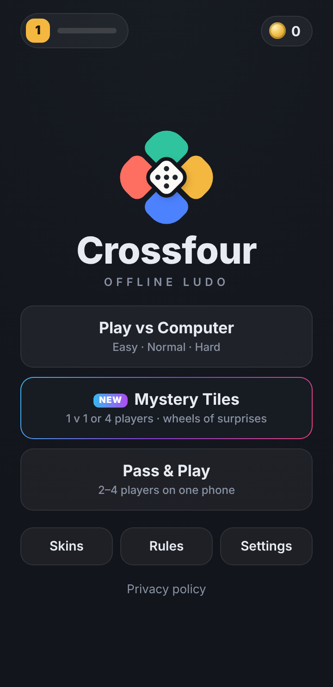
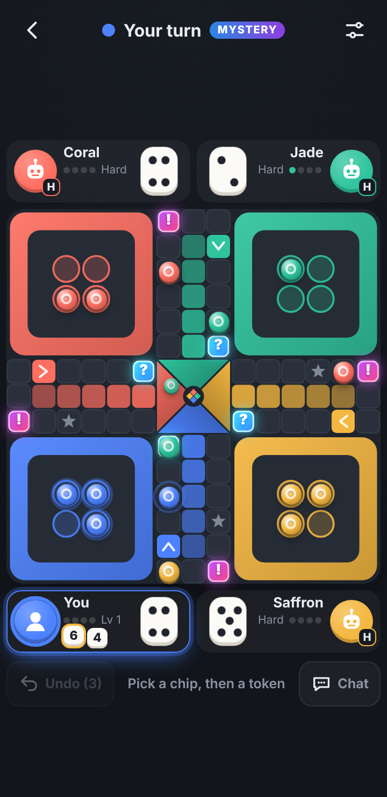
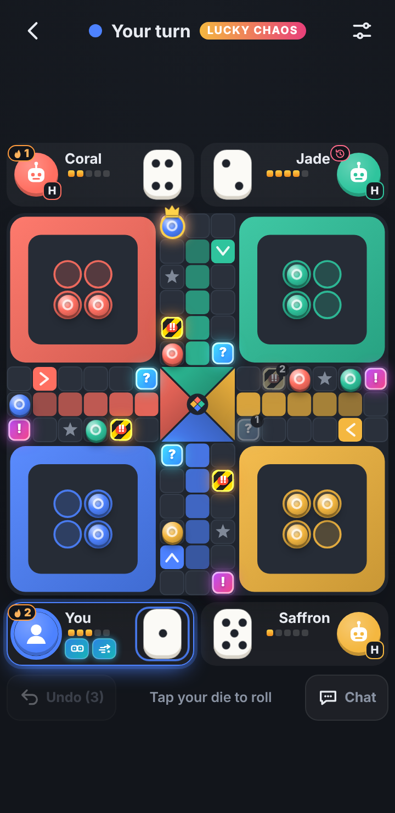
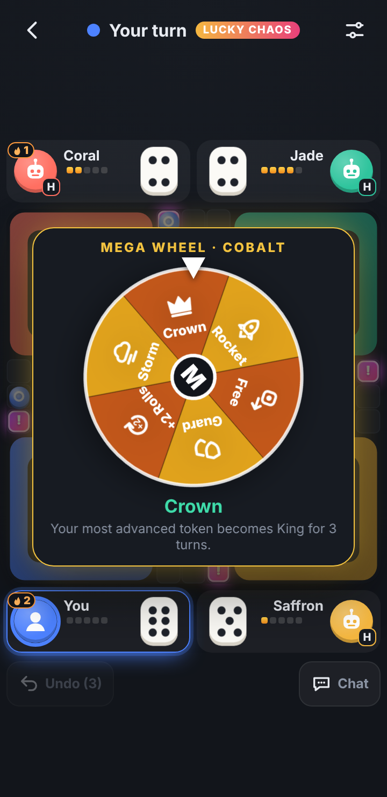
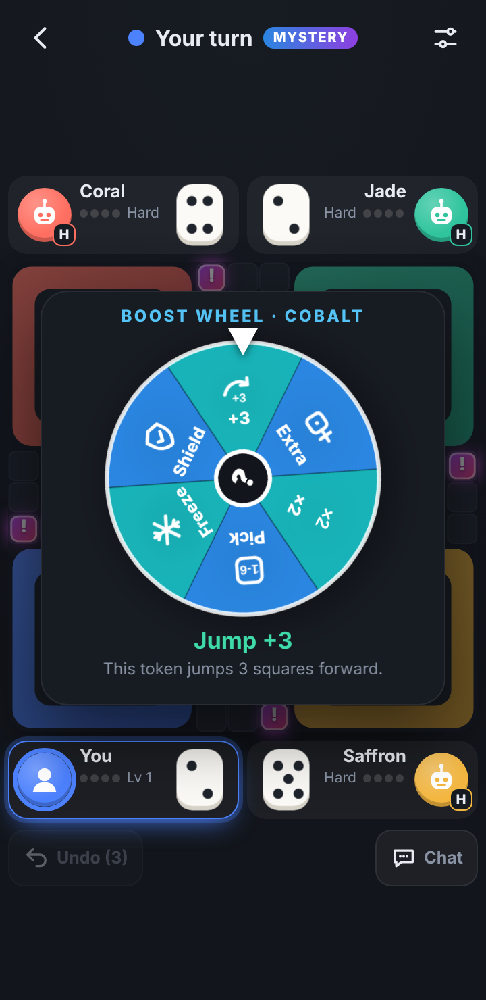
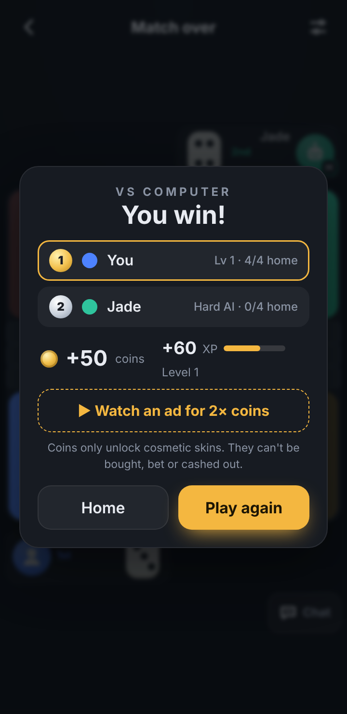

# ◆ Online Ludo

Online Ludo is being developed online-first, with the existing local game modes and saves retained. This branch connects the client to a dedicated Supabase backend for email/password accounts, cloud profiles, server-owned balances and lobby matchmaking. Email/password authentication is enabled; the portal accepts credentials from the user and does not hardcode or save passwords in local game data. Email confirmation is required for new accounts, but custom SMTP is deferred. Supabase's default Auth sender only delivers to project-team addresses, so signup-confirmation and password-reset links may not reach external email addresses until custom SMTP is configured. Google and Facebook sign-in are not used. The current online scope is lobby/profile/wallet sync only: the shared board, dice, turns and verified results are not synchronized. Offline coins remain local and are never copied to cloud wallets.

Local modes include computer players (**Easy, Normal, Hard**), pass & play for 2–4 players, **Lucky Chaos Ludo** (Boost/Chaos wheels, Danger tiles, Lucky Streaks, Revenge, a Mega Wheel and King tokens), per-player dice, stacked sixes, Mystery Tiles, Undo dice roll, quick chat, cosmetics, levels/XP and ranked local results. The app is written in vanilla HTML/CSS/JavaScript and ships as an **Android app** (Capacitor 8 + Google AdMob) built and signed by **GitHub Actions**.

**▶ Play the live demo:** https://offerpk.github.io/offline-ludo/
**Privacy policy:** https://offerpk.github.io/offline-ludo/privacy.html
**Android downloads (signed AAB/APK):** [Releases](https://github.com/OfferPk/offline-ludo/releases)

<p align="center">
  
  
  
  
  
  
</p>

## How to play

Full rules: **[RULES.md](RULES.md)** (also in the game under **Rules**). In short:

- Every player rolls **their own die**, shown in their own corner next to their avatar (you sit bottom-left). The active player is highlighted; an optional 20 s turn timer ring is off by default.
- **Star style (default):** a 6 gives another roll straight away; rolls stack as **dice chips** (e.g. 6, 6, 3). After the non-6 roll you tap a chip, then a token (auto when only one move is possible). **Three 6s in a row forfeit the whole turn.** A **capture** and a token **reaching home** each give a bonus roll.
- 6 to leave base, exact roll to reach home, safe start and star squares.
- **House rules** in Settings: Star style vs **Classic** (move each 6 before rolling again), safe squares, **capture to enter home**, **blocks**, capture/home bonus rolls.
- **Undo dice roll:** about 2 s after your roll, 3 free per match; one more only via an optional rewarded ad that the player taps.
- Finishing a match earns cosmetic **coins** and **XP/levels**. Coins only unlock board and dice skins; they can't be bought, bet, wagered or cashed out. There are no purchases and no entry fees.

## Modes

- **Play vs Computer:** 1 v 1 (opposite corners), 3 or 4 players, each computer Easy / Normal / Hard.
- **Lucky Chaos Ludo (new in v1.2):** 4 **?** Boost tiles (Shield, Jump +3, Double Roll, Extra Roll, Lucky 6, Safe Escape), 4 **!** Chaos tiles (Bomb, Swap, Zap, Freeze, Back 3, Wild Jump) and 4 **!!** Danger tiles (High Risk / High Reward: 50/50 wheel, stronger results). Lucky Streak, Revenge Charge (pick 1 of 2 results), Lucky Charge meter → manual **Mega Wheel**, **King** tokens (2 captures → crown), up to 2 stored powers, 3-second decision windows, capped comeback help and near-home protections. 1 v 1 or 4 players, vs AI or pass & play. See [RULES.md](RULES.md#lucky-chaos-ludo-mode-new-in-v12). No stake or entry fee.
- **Mystery Tiles (v1.1):** 4 **?** tiles spin the Boost wheel (Shield, Jump +3, Extra roll, Double die, Pick a number, Freeze) and 4 **!** tiles spin the Chaos wheel (Back 3, Swap, Zap, Stuck, Jump +6, Calm). Tiles recharge for two rounds after use. 1 v 1 or 4 players. No stake or entry fee.
- **Pass & Play:** 2–4 humans on one phone (humans and computers can be mixed).

## Features

- **Three AI levels** (`chooseMove()` in `www/js/logic.js`): Easy (mostly random), Normal (simple priorities), Hard (scores captures, safety vs. stacked-6 threats, escaping, blocks, mystery tiles and event targets; uses Pick-a-number sensibly). In the test suite Hard beats Easy ~93% and Normal ~87% of 1 v 1 games.
- **Quick chat & emotes:** preset phrases and 8 original drawn emoji faces shown as bubbles at the player's corner; computer players react now and then (toggle). Everything is local and cosmetic: there is no online chat.
- **Feel:** 3D dice per player, tokens stepping square by square, capture bursts with a board shake, animated event wheels, zap/freeze/shield effects, **WebAudio** synthesized sounds (no audio files), **haptics** via `@capacitor/haptics`. Sound, haptics, auto-move, undo, timer, computer chat and fast animations are toggles in Settings.
- **Save & resume:** a validated, versioned local snapshot keeps the whole match (including dice RNG state), profile/progression, settings and statistics on this device. A last-known-good checkpoint supports recovery; failed writes are shown in the app. v2 saves migrate with match progress, and v1 profile/settings/statistics migrate without treating their incompatible match format as resumable. This local-save boundary is separate from the optional online account/lobby work; no local game state or offline balance is uploaded.
- **Skins:** boards Graphite and Linen (free), Walnut and Aurora; dice Ivory (free), Onyx, Brass, Frost and Ember.
- **Stats:** level/XP, matches, wins, win rate, captures, tokens home, sixes, wins vs each AI level, Mystery and Lucky Chaos wins, 1 v 1 and 4-player wins, events triggered. Result screen ranks all players 1st–4th.
- Original art and name: flat board with muted jewel colours (Coral, Jade, Saffron, Cobalt), simple robot/person avatars and drawn emoji faces, no mascots. It doesn't use the names, logos, art or designs of other Ludo apps.

## Online backend status

The live project is **Online Ludo** (`exggyvbsqhoasrqgzerf`, `ap-southeast-1`); the frontend uses its public publishable key, and the additive schema/RLS migrations have been applied and checked. The portal supports email/password sign-in, account creation, confirmation and reset-return flows, cloud profile and read-only wallet sync, room invites, quick matchmaking, readiness, roster/profile updates and participant-visible history refreshes. The project's email provider and signup are enabled; email confirmation is required, and SMTP setup is deferred. Supabase's default sender only delivers to addresses in the project's team, so confirmations and reset links to other addresses may not arrive until custom SMTP is configured. Google and Facebook sign-in remain disabled and are not used. A started table is still only a lobby record: there is no shared board, dice/turn synchronization, verified winner flow or client-callable currency change. Offline play, saves, progression and coins remain local. See [Online Ludo backend setup](docs/online-backend-setup.md) for exact project and authentication status.

## Project layout

```
www/                  ← the whole game (also the Capacitor webDir & the Pages site)
  index.html, css/style.css, privacy.html, icon.png
  js/logic.js         ← pure rules engine v2: geometry, stacked rolls, captures, safe squares, blocks, Mystery Tiles events, AI, simulator
  js/game.js          ← canvas board, player pods & dice, chips, wheel, animations, turn flow, undo roll, chat, skins, settings
  js/save-store.js    ← local-only versioned snapshot boundary, migration and last-known-good recovery
  js/art.js           ← original SVG emotes, event icons and avatars
  js/sound.js         ← WebAudio SFX
  js/themes.js        ← cosmetic board and dice skins
  js/ads-config.js    ← ★ ALL AdMob IDs + pacing numbers live here
  js/adgate.js        ← interstitial pacing rules (pure, unit-tested)
  js/ads.js           ← UMP consent, banner, interstitial, rewarded
android/              ← Capacitor Android project (committed)
assets/               ← icon/splash generator (make_icon.py) + 512 px store icon
store/                ← Google Play listing kit (graphics, text, answers, checklist, capture scripts)
test/                  ← logic, save-store + ad-gate tests (Node) and a headless-Chrome play test
.github/workflows/    ← android.yml (signed AAB/APK + Releases), pages.yml (web demo)
```

## Run locally

```bash
npm install
npm run serve          # http://localhost:8080
npm test               # rules/simulations, save migration/validation/recovery/determinism, and ad pacing
GAMES=200 node test/logic.test.js   # quicker run
```

Headless phone-size (360x740) play test through the UI: local v1/v2 migration, save-failure warning, reload/resume with deterministic continuation, plus pods and per-player dice positions, stacked 6,6,3 chips, undo dice roll, chip + token moves, emote bubble, triple-6 forfeit, exact home and ranked result, Mystery Tiles 4-player with Boost and Chaos wheel events, Lucky Chaos Ludo (How to play, Danger tile wheel, Revenge choice, decision-window auto-pick, stored power, Mega Wheel, King crown, computers spending Mega spins), and pass & play with the Classic rule; it fails on any console error:

```bash
npm i --no-save puppeteer-core
PUPPETEER=puppeteer-core node test/browser.test.js http://localhost:8080/ /tmp   # Chrome at /usr/bin/google-chrome (or CHROME=...)
```

## Ads (AdMob) and the ad rules

| Hook | When | In a browser |
|---|---|---|
| `Ads.init()` | on launch: **UMP consent** + SDK init only, **no ad is shown** | no-op |
| `Ads.showBanner()` | adaptive banner at the bottom of the **menu and gameplay screens**; the layout reserves its height so it never covers the board or the die | no-op |
| `Ads.maybeInterstitial(gate)` | only when leaving the **match result** screen (**Play again** or **Home**), when `AdGate` allows it | never |
| `Ads.showRewarded(cb)` | only when the player taps **Undo ▶ AD** (an extra dice-roll undo after the 3 free ones in a match) or **▶ 2× coins** on the result screen. The reward is granted only on the SDK's *earned reward* event | grants the reward immediately |

Interstitial pacing, enforced in `www/js/adgate.js` and tested in `test/adgate.test.js`:

- **None in the first session** (first app launch), and none until the player has completed **5 matches** *and* played for **3 minutes** in total.
- After that, at most **one every 2 completed matches** and at most **one per 120 s**, only after a match has ended. If an ad isn't ready, the game simply continues.
- **Never** on launch, exit, back press or mid-match. There are no app-open ads, and the pacing state is saved so restarting the app doesn't reset it.

### Swapping in your real AdMob IDs

The repo uses **Google's official test IDs**. Change them in exactly **two** places:

1. **`www/js/ads-config.js`**: set `APP_ID`, `BANNER_ID`, `INTERSTITIAL_ID` and `REWARDED_ID`, then set `IS_TESTING: false`.
2. **`android/app/src/main/AndroidManifest.xml`**: set the `com.google.android.gms.ads.APPLICATION_ID` meta-data value to your real **App ID** (`ca-app-pub-XXXX~YYYY`).

Then bump the version, commit and tag. CI builds a new signed AAB. In AdMob, also publish a **Privacy & messaging → GDPR message** so the consent form appears, and add an `app-ads.txt` to your developer website.

## Android build

- Capacitor 8, appId **`com.offerpk.offlineludo`** (retained for Android update and email-confirmation/password-reset deep-link compatibility), name **Online Ludo** (launcher label), plugins `@capacitor-community/admob` 8.1.0 and `@capacitor/haptics` 8.
- `compileSdk`/`targetSdk` **36**, `minSdk` **24**, versionCode **2**, versionName **1.1.0** (in `android/app/build.gradle` / `android/variables.gradle`).
- Permissions: `INTERNET`, `ACCESS_NETWORK_STATE`, `AD_ID` (AdMob) and `VIBRATE` (haptics). No billing: the game has no purchases.

### CI (GitHub Actions)

`.github/workflows/android.yml` runs on every push to `main`, on `v*` tags, and on manual dispatch: Node 22 + JDK 21 → `npm ci` → `npm test` → `npx cap sync android` → `./gradlew bundleRelease assembleRelease` → it prints the APK's `targetSdkVersion` with `aapt2` and verifies the signatures. The signed **`.aab`** and **`.apk`** are uploaded as artifacts, and a `v*` tag also creates a **GitHub Release** with both files attached. `pages.yml` deploys `www/` to GitHub Pages.

Signing uses these repository secrets (the keystore and passwords are **never** committed):

| Secret | Contents |
|---|---|
| `KEYSTORE_BASE64` | `base64 -w0 upload.jks` |
| `KEYSTORE_PASSWORD` | keystore password |
| `KEY_ALIAS` | key alias (`upload`) |
| `KEY_PASSWORD` | key password |

### Build locally

```bash
npm ci
npx cap sync android
cd android
ANDROID_KEYSTORE_FILE=/path/upload.jks KEYSTORE_PASSWORD=... KEY_ALIAS=upload KEY_PASSWORD=... \
  ./gradlew bundleRelease assembleRelease
```

### Icons and splash

`python3 assets/make_icon.py` regenerates the original launcher icons (legacy, round and adaptive foreground), the splash screens, `www/icon.png` and the 512 px store icons.

## Releasing to Google Play

See **[`store/LAUNCH-CHECKLIST.md`](store/LAUNCH-CHECKLIST.md)** (it opens with a Roman Urdu summary), [`store/listing-en.md`](store/listing-en.md) and [`store/play-console-answers.md`](store/play-console-answers.md).

1. Bump `versionCode` (+1 every upload) and `versionName` (the real-ads build is planned as **v1.2.1 / versionCode 4**), and switch to your real AdMob IDs.
2. `git tag v1.2.1 && git push origin v1.2.1`. CI attaches `offline-ludo-v1.2.1.aab` and `.apk` to a Release.
3. Upload the `.aab` in Play Console with **Play App Signing** turned on. The CI keystore is your **upload key**.

## License

[MIT](LICENSE) © 2026 OfferPk. See also the [Privacy Policy](PRIVACY.md).
