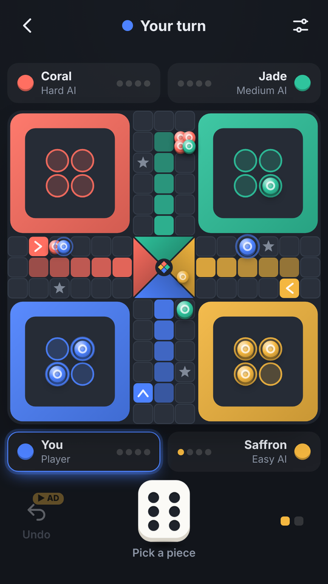
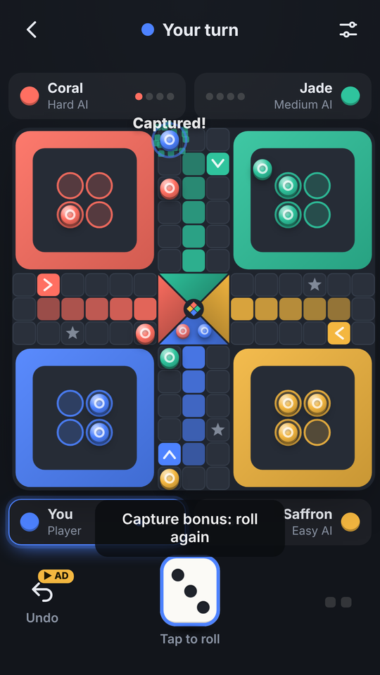
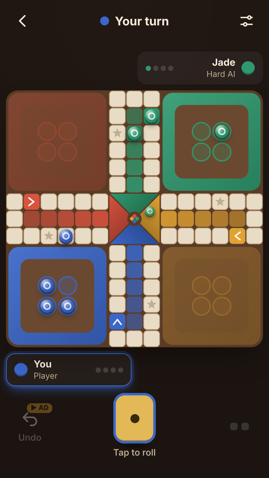

# ◆ Crossfour: Offline Ludo

A modern, **fully offline Ludo** for 2–4 players. Play against computer players (**Easy, Medium, Hard**), pass one phone around with friends, or mix both. There's no server, no login and no online mode. It's written in vanilla HTML/CSS/JavaScript (the board is drawn on a canvas) with no framework, and ships as an **Android app** (Capacitor 8 + Google AdMob) that **GitHub Actions** builds and signs automatically.

**▶ Play the live demo:** https://offerpk.github.io/offline-ludo/
**Privacy policy:** https://offerpk.github.io/offline-ludo/privacy.html
**Android downloads (signed AAB/APK):** [Releases](https://github.com/OfferPk/offline-ludo/releases)

<p align="center">
  
  
  
  
</p>

## How to play

- Each player has 4 pieces in a base. Roll a **6** to bring a piece out onto your start square.
- Pieces move clockwise around the 52-square track, then up your own coloured lane to the centre. You need the **exact roll** to reach home.
- Land on an opponent to **capture** it: the piece goes back to its base. All opponent pieces on that square are captured.
- **Three 6s in a row** lose the turn (the third roll is not played).
- Options for each match: **safe squares** (the 4 start squares and 4 stars protect pieces), **extra turn on a 6**, and **extra turn on a capture**. All three are on by default.
- When only one distinct move is possible, it's played for you (**auto-move**, can be switched off).
- The match ends when all humans have finished (the rest are ranked by progress), or when only one player is left.
- Finishing a match earns **coins** (by the best human placement, 6–50) that unlock cosmetic **board and dice skins**. Coins can't be bought, bet, wagered or cashed out. There are no purchases.

## Features

- **2–4 players, any mix:** each colour can be Off, Human, Easy AI, Medium AI or Hard AI. Humans take turns on one phone (pass & play).
- **Three AI levels** (`chooseMove()` in `www/js/logic.js`):
  - **Easy:** mostly random, takes an obvious capture or finish half the time.
  - **Medium:** simple priorities: capture, finish, leave base, enter the home lane, safe squares, progress.
  - **Hard:** scores every move: captures (worth more the further the victim had travelled), getting pieces home, entering the home lane, landing on safe squares, **avoiding squares that opponents can hit next roll**, escaping threatened squares, and leaving base.

  In 2-player tests Hard beats Easy about 89% of the time and Medium about 82%.
- **Feel:** a 3D dice roll, pieces stepping square by square, capture bursts with a board shake, "Home!" effects, **WebAudio** synthesized sounds (no audio files) and light **haptics** via `@capacitor/haptics`. Sound, haptics, auto-move and fast animations are toggles in Settings.
- **Save & resume:** the whole match (including the dice RNG state) is saved after every roll and move; Continue picks it up after closing the app.
- **Skins:** boards Graphite and Linen (free), Walnut and Aurora; dice Ivory (free), Onyx, Brass, Frost and Ember.
- **Stats:** matches, wins, win rate, captures, pieces home, sixes, and wins vs each AI level.
- Original art and name: a clean flat board with muted jewel colours (Coral, Jade, Saffron, Cobalt), disc-shaped pieces, no mascots or crowns. It doesn't use the names, logos or designs of other Ludo apps.

## Project layout

```
www/                  ← the whole game (also the Capacitor webDir & the Pages site)
  index.html, css/style.css, privacy.html, icon.png
  js/logic.js         ← pure rules: board geometry, moves, captures, safe squares, sixes, turn order, AI, simulator
  js/game.js          ← canvas board, DOM pieces & dice, animations, turn flow, undo, persistence, skins, settings
  js/sound.js         ← WebAudio SFX
  js/themes.js        ← cosmetic board and dice skins
  js/ads-config.js    ← ★ ALL AdMob IDs + pacing numbers live here
  js/adgate.js        ← interstitial pacing rules (pure, unit-tested)
  js/ads.js           ← UMP consent, banner, interstitial, rewarded
android/              ← Capacitor Android project (committed)
assets/               ← icon/splash generator (make_icon.py) + 512 px store icon
store/                ← Google Play listing kit (graphics, text, answers, checklist, capture scripts)
test/                 ← logic + ad-gate tests (Node) and a headless-Chrome play test
.github/workflows/    ← android.yml (signed AAB/APK + Releases), pages.yml (web demo)
```

## Run locally

```bash
npm install
npm run serve          # http://localhost:8080
npm test               # rules, captures, safe squares, exact home, triple 6, toggles, AI sanity, 1000 AI-vs-AI games, ad pacing
GAMES=200 node test/logic.test.js   # quicker run
```

Headless phone-size play test (plays through the UI with taps: setup validation, 6 to leave base, auto-move, choosing a piece, capture + effect, extra rolls, undo vs AI, exact home, triple 6, save/resume after reload, winning a match, 2× coins, pass & play with a rule off, buying skins, settings, and it fails on any console error):

```bash
npm i --no-save puppeteer-core
PUPPETEER=puppeteer-core node test/browser.test.js http://localhost:8080/ /tmp   # Chrome at /usr/bin/google-chrome (or CHROME=...)
```

## Ads (AdMob) and the ad rules

| Hook | When | In a browser |
|---|---|---|
| `Ads.init()` | on launch: **UMP consent** + SDK init only, **no ad is shown** | no-op |
| `Ads.showBanner()` | adaptive banner at the bottom of the **menu and gameplay screens**; the layout reserves its height so it never covers the board or the die | no-op |
| `Ads.maybeInterstitial(gate)` | only when leaving the **match result** screen (**Play again** or **Home**), when `AdGate` allows it | never |
| `Ads.showRewarded(cb)` | only when the player taps **▶ Undo** (undo your last move in a match with computer players, up to 3 per match) or **▶ 2× coins** on the result screen. The reward is granted only on the SDK's *earned reward* event | grants the reward immediately |

Interstitial pacing, enforced in `www/js/adgate.js` and tested in `test/adgate.test.js`:

- **None in the first session** (first app launch), and none until the player has completed **3 matches** *and* played for **3 minutes** in total.
- After that, at most **one every 2 completed matches** and at most **one per 120 s**, only after a match has ended. If an ad isn't ready, the game simply continues.
- **Never** on launch, exit, back press or mid-match. There are no app-open ads, and the pacing state is saved so restarting the app doesn't reset it.

### Swapping in your real AdMob IDs

The repo uses **Google's official test IDs**. Change them in exactly **two** places:

1. **`www/js/ads-config.js`**: set `APP_ID`, `BANNER_ID`, `INTERSTITIAL_ID` and `REWARDED_ID`, then set `IS_TESTING: false`.
2. **`android/app/src/main/AndroidManifest.xml`**: set the `com.google.android.gms.ads.APPLICATION_ID` meta-data value to your real **App ID** (`ca-app-pub-XXXX~YYYY`).

Then bump the version, commit and tag. CI builds a new signed AAB. In AdMob, also publish a **Privacy & messaging → GDPR message** so the consent form appears, and add an `app-ads.txt` to your developer website.

## Android build

- Capacitor 8, appId **`com.offerpk.offlineludo`**, name **Crossfour Ludo** (launcher label), plugins `@capacitor-community/admob` 8.1.0 and `@capacitor/haptics` 8.
- `compileSdk`/`targetSdk` **36**, `minSdk` **24**, versionCode **1**, versionName **1.0.0** (in `android/app/build.gradle` / `android/variables.gradle`).
- Permissions: `INTERNET`, `ACCESS_NETWORK_STATE`, `AD_ID` (AdMob) and `VIBRATE` (haptics). No billing: the game has no purchases.

### CI (GitHub Actions)

`.github/workflows/android.yml` runs on every push to `main`, on `v*` tags, and on manual dispatch: Node 22 + JDK 21 → `npm ci` → `npm test` → `npx cap sync android` → `./gradlew bundleRelease assembleRelease` → it prints the APK's `targetSdkVersion` with `aapt2` and verifies the signatures. The signed **`.aab`** and **`.apk`** are uploaded as artifacts, and a `v*` tag also creates a **GitHub Release** with both files attached. `pages.yml` deploys `www/` to GitHub Pages.

Signing uses these repository secrets (the keystore and passwords are **never** committed):

| Secret | Contents |
|---|---|
| `KEYSTORE_BASE64` | `base64 -w0 upload.jks` |
| `KEYSTORE_PASSWORD` | keystore password |
| `KEY_ALIAS` | key alias (`upload`) |
| `KEY_PASSWORD` | key password |

### Build locally

```bash
npm ci
npx cap sync android
cd android
ANDROID_KEYSTORE_FILE=/path/upload.jks KEYSTORE_PASSWORD=... KEY_ALIAS=upload KEY_PASSWORD=... \
  ./gradlew bundleRelease assembleRelease
```

### Icons and splash

`python3 assets/make_icon.py` regenerates the original launcher icons (legacy, round and adaptive foreground), the splash screens, `www/icon.png` and the 512 px store icons.

## Releasing to Google Play

See **[`store/LAUNCH-CHECKLIST.md`](store/LAUNCH-CHECKLIST.md)** (it opens with a Roman Urdu summary), [`store/listing-en.md`](store/listing-en.md) and [`store/play-console-answers.md`](store/play-console-answers.md).

1. Bump `versionCode` (+1 every upload) and `versionName`, and switch to your real AdMob IDs.
2. `git tag v1.0.1 && git push origin v1.0.1`. CI attaches `offline-ludo-v1.0.1.aab` and `.apk` to a Release.
3. Upload the `.aab` in Play Console with **Play App Signing** turned on. The CI keystore is your **upload key**.

## License

[MIT](LICENSE) © 2026 OfferPk. See also the [Privacy Policy](PRIVACY.md).
